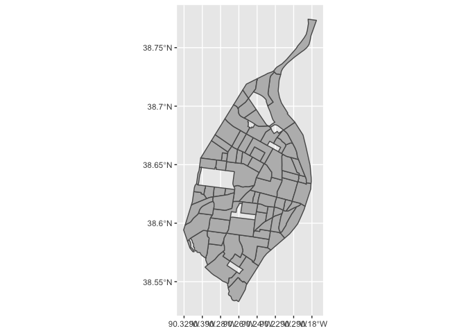
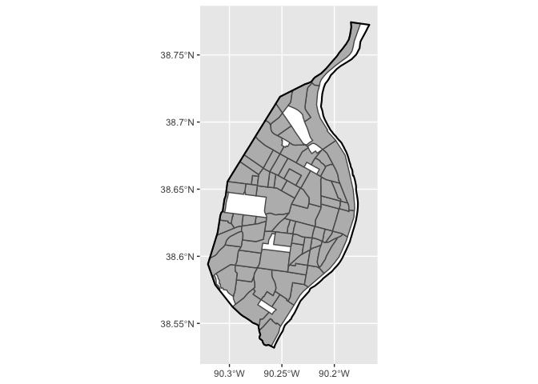
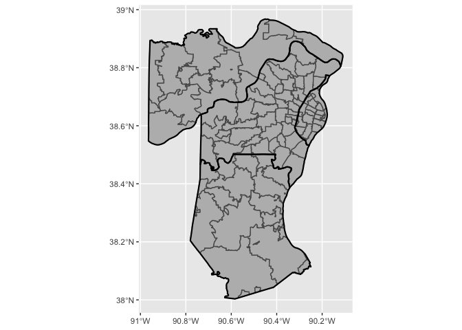
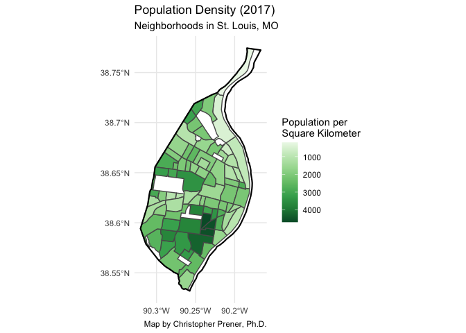
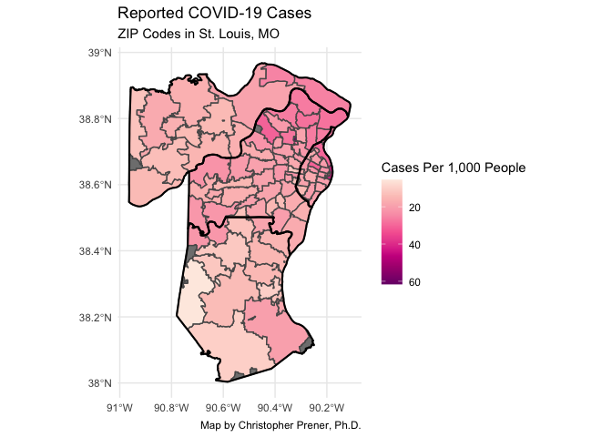
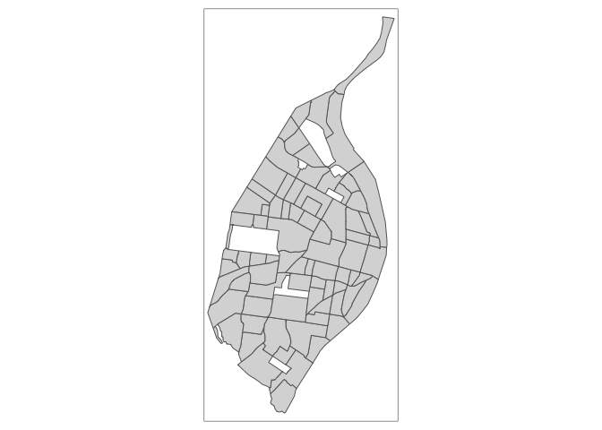
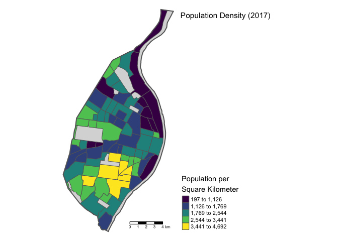
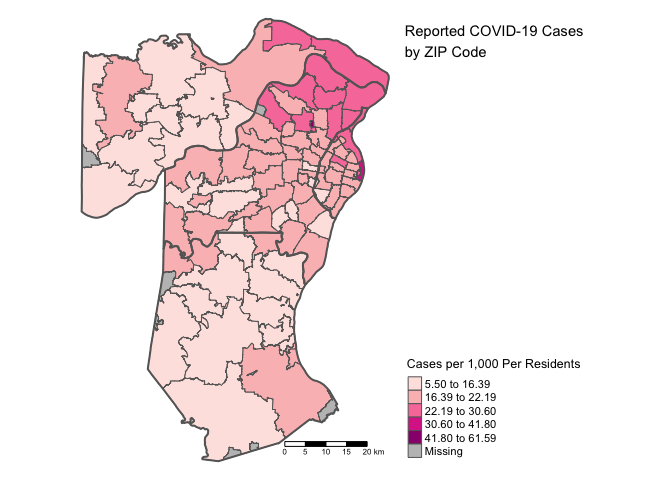

GIS-03 - Mapping with ggplot2 and tamp - Complete
================
Christopher Prener, Ph.D.
(September 23, 2020)

## Introduction

This notebook expands mapping to two new packages - `ggplot2` and
`tmap`. We’ll focus on thematic choropleth mapping today.

## Dependencies

This notebook requires a variety of packages for working with spatial
data:

``` r
# tidyverse packages
library(dplyr)        # data wrangling
```

    ## Warning: package 'dplyr' was built under R version 4.0.2

    ## 
    ## Attaching package: 'dplyr'

    ## The following objects are masked from 'package:stats':
    ## 
    ##     filter, lag

    ## The following objects are masked from 'package:base':
    ## 
    ##     intersect, setdiff, setequal, union

``` r
library(ggplot2)      # plotting
```

    ## Warning: package 'ggplot2' was built under R version 4.0.2

``` r
# spatial packages
library(mapview)      # preview spatial data
```

    ## Warning: package 'mapview' was built under R version 4.0.2

    ## GDAL version >= 3.1.0 | setting mapviewOptions(fgb = TRUE)

``` r
library(sf)           # spatial data tools
```

    ## Warning: package 'sf' was built under R version 4.0.2

    ## Linking to GEOS 3.8.1, GDAL 3.1.1, PROJ 6.3.1

``` r
library(tigris)       # access TIGER/Line shapefile data
```

    ## To enable 
    ## caching of data, set `options(tigris_use_cache = TRUE)` in your R script or .Rprofile.

``` r
library(tmap)         # mapping

# other packages
library(here)         # file path management
```

    ## here() starts at /Users/prenercg/GitHub/DSS/gis-03

``` r
library(RColorBrewer) # color palettes
```

## Load Data

First, we need to load up our data. This is review from the first
session, and so we’ve pre-filled the code for you. We’ll automatically
re-project the data as well (also review):

``` r
# polygon data 1 - St. Louis Neighborhood Population
nhood <- st_read(here("data", "STL_DEMOS_Nhoods", "STL_DEMOS_Nhoods.shp")) %>%
  st_transform(crs = 4326)
```

    ## Reading layer `STL_DEMOS_Nhoods' from data source `/Users/prenercg/GitHub/DSS/gis-03/data/STL_DEMOS_Nhoods/STL_DEMOS_Nhoods.shp' using driver `ESRI Shapefile'
    ## Simple feature collection with 79 features and 6 fields
    ## geometry type:  MULTIPOLYGON
    ## dimension:      XY
    ## bbox:           xmin: 733361.8 ymin: 4268512 xmax: 745417.9 ymax: 4295501
    ## projected CRS:  UTM_Zone_15_Northern_Hemisphere

``` r
# polygon data 2 - St. Louis COVID Cases by ZIP Code
covid <- st_read(here("data", "daily_snapshot_regional.geojson"))
```

    ## Reading layer `daily_snapshot_regional' from data source `/Users/prenercg/GitHub/DSS/gis-03/data/daily_snapshot_regional.geojson' using driver `GeoJSON'
    ## Simple feature collection with 106 features and 6 fields
    ## geometry type:  MULTIPOLYGON
    ## dimension:      XY
    ## bbox:           xmin: -90.96446 ymin: 38.0035 xmax: -90.10911 ymax: 38.96777
    ## geographic CRS: WGS 84

## Download a Bit of Extra Data

We’ll use the same process as last week to create boundary data for both
the city and the region:

``` r
region <- counties(state = 29) %>%
  select(GEOID, NAMELSAD) %>%
  filter(GEOID %in% c("29099", "29183", "29189", "29510")) %>%
  st_transform(crs = 4326)
```

    ##   |                                                                              |                                                                      |   0%  |                                                                              |                                                                      |   1%  |                                                                              |=                                                                     |   1%  |                                                                              |=                                                                     |   2%  |                                                                              |==                                                                    |   2%  |                                                                              |==                                                                    |   3%  |                                                                              |==                                                                    |   4%  |                                                                              |===                                                                   |   4%  |                                                                              |===                                                                   |   5%  |                                                                              |====                                                                  |   5%  |                                                                              |====                                                                  |   6%  |                                                                              |=====                                                                 |   6%  |                                                                              |=====                                                                 |   7%  |                                                                              |=====                                                                 |   8%  |                                                                              |======                                                                |   8%  |                                                                              |======                                                                |   9%  |                                                                              |=======                                                               |   9%  |                                                                              |=======                                                               |  10%  |                                                                              |=======                                                               |  11%  |                                                                              |========                                                              |  11%  |                                                                              |========                                                              |  12%  |                                                                              |=========                                                             |  12%  |                                                                              |=========                                                             |  13%  |                                                                              |=========                                                             |  14%  |                                                                              |==========                                                            |  14%  |                                                                              |==========                                                            |  15%  |                                                                              |===========                                                           |  15%  |                                                                              |===========                                                           |  16%  |                                                                              |============                                                          |  16%  |                                                                              |============                                                          |  17%  |                                                                              |============                                                          |  18%  |                                                                              |=============                                                         |  18%  |                                                                              |=============                                                         |  19%  |                                                                              |==============                                                        |  19%  |                                                                              |==============                                                        |  20%  |                                                                              |==============                                                        |  21%  |                                                                              |===============                                                       |  21%  |                                                                              |===============                                                       |  22%  |                                                                              |================                                                      |  22%  |                                                                              |================                                                      |  23%  |                                                                              |================                                                      |  24%  |                                                                              |=================                                                     |  24%  |                                                                              |=================                                                     |  25%  |                                                                              |==================                                                    |  25%  |                                                                              |==================                                                    |  26%  |                                                                              |===================                                                   |  26%  |                                                                              |===================                                                   |  27%  |                                                                              |===================                                                   |  28%  |                                                                              |====================                                                  |  28%  |                                                                              |====================                                                  |  29%  |                                                                              |=====================                                                 |  29%  |                                                                              |=====================                                                 |  30%  |                                                                              |=====================                                                 |  31%  |                                                                              |======================                                                |  31%  |                                                                              |======================                                                |  32%  |                                                                              |=======================                                               |  32%  |                                                                              |=======================                                               |  33%  |                                                                              |=======================                                               |  34%  |                                                                              |========================                                              |  34%  |                                                                              |========================                                              |  35%  |                                                                              |=========================                                             |  35%  |                                                                              |=========================                                             |  36%  |                                                                              |==========================                                            |  36%  |                                                                              |==========================                                            |  37%  |                                                                              |==========================                                            |  38%  |                                                                              |===========================                                           |  38%  |                                                                              |===========================                                           |  39%  |                                                                              |============================                                          |  39%  |                                                                              |============================                                          |  40%  |                                                                              |============================                                          |  41%  |                                                                              |=============================                                         |  41%  |                                                                              |=============================                                         |  42%  |                                                                              |==============================                                        |  42%  |                                                                              |==============================                                        |  43%  |                                                                              |==============================                                        |  44%  |                                                                              |===============================                                       |  44%  |                                                                              |===============================                                       |  45%  |                                                                              |================================                                      |  45%  |                                                                              |================================                                      |  46%  |                                                                              |=================================                                     |  46%  |                                                                              |=================================                                     |  47%  |                                                                              |=================================                                     |  48%  |                                                                              |==================================                                    |  48%  |                                                                              |==================================                                    |  49%  |                                                                              |===================================                                   |  49%  |                                                                              |===================================                                   |  50%  |                                                                              |===================================                                   |  51%  |                                                                              |====================================                                  |  51%  |                                                                              |====================================                                  |  52%  |                                                                              |=====================================                                 |  52%  |                                                                              |=====================================                                 |  53%  |                                                                              |=====================================                                 |  54%  |                                                                              |======================================                                |  54%  |                                                                              |======================================                                |  55%  |                                                                              |=======================================                               |  55%  |                                                                              |=======================================                               |  56%  |                                                                              |========================================                              |  56%  |                                                                              |========================================                              |  57%  |                                                                              |========================================                              |  58%  |                                                                              |=========================================                             |  58%  |                                                                              |=========================================                             |  59%  |                                                                              |==========================================                            |  59%  |                                                                              |==========================================                            |  60%  |                                                                              |==========================================                            |  61%  |                                                                              |===========================================                           |  61%  |                                                                              |===========================================                           |  62%  |                                                                              |============================================                          |  62%  |                                                                              |============================================                          |  63%  |                                                                              |============================================                          |  64%  |                                                                              |=============================================                         |  64%  |                                                                              |=============================================                         |  65%  |                                                                              |==============================================                        |  65%  |                                                                              |==============================================                        |  66%  |                                                                              |===============================================                       |  66%  |                                                                              |===============================================                       |  67%  |                                                                              |===============================================                       |  68%  |                                                                              |================================================                      |  68%  |                                                                              |================================================                      |  69%  |                                                                              |=================================================                     |  69%  |                                                                              |=================================================                     |  70%  |                                                                              |=================================================                     |  71%  |                                                                              |==================================================                    |  71%  |                                                                              |==================================================                    |  72%  |                                                                              |===================================================                   |  72%  |                                                                              |===================================================                   |  73%  |                                                                              |===================================================                   |  74%  |                                                                              |====================================================                  |  74%  |                                                                              |====================================================                  |  75%  |                                                                              |=====================================================                 |  75%  |                                                                              |=====================================================                 |  76%  |                                                                              |======================================================                |  76%  |                                                                              |======================================================                |  77%  |                                                                              |======================================================                |  78%  |                                                                              |=======================================================               |  78%  |                                                                              |=======================================================               |  79%  |                                                                              |========================================================              |  79%  |                                                                              |========================================================              |  80%  |                                                                              |========================================================              |  81%  |                                                                              |=========================================================             |  81%  |                                                                              |=========================================================             |  82%  |                                                                              |==========================================================            |  82%  |                                                                              |==========================================================            |  83%  |                                                                              |==========================================================            |  84%  |                                                                              |===========================================================           |  84%  |                                                                              |===========================================================           |  85%  |                                                                              |============================================================          |  85%  |                                                                              |============================================================          |  86%  |                                                                              |=============================================================         |  86%  |                                                                              |=============================================================         |  87%  |                                                                              |=============================================================         |  88%  |                                                                              |==============================================================        |  88%  |                                                                              |==============================================================        |  89%  |                                                                              |===============================================================       |  89%  |                                                                              |===============================================================       |  90%  |                                                                              |===============================================================       |  91%  |                                                                              |================================================================      |  91%  |                                                                              |================================================================      |  92%  |                                                                              |=================================================================     |  92%  |                                                                              |=================================================================     |  93%  |                                                                              |=================================================================     |  94%  |                                                                              |==================================================================    |  94%  |                                                                              |==================================================================    |  95%  |                                                                              |===================================================================   |  95%  |                                                                              |===================================================================   |  96%  |                                                                              |====================================================================  |  96%  |                                                                              |====================================================================  |  97%  |                                                                              |====================================================================  |  98%  |                                                                              |===================================================================== |  98%  |                                                                              |===================================================================== |  99%  |                                                                              |======================================================================|  99%  |                                                                              |======================================================================| 100%

``` r
city <- filter(region, GEOID == "29510")
```

## Simple Maps with `ggplot2`

### Basic Mapping of Geometric Objects

`ggplot2` is the premier graphics package for `R`. It is an incredibly
powerful visualization tool that increasingly supports spatial work and
mapping. The basic `ggplot2` workflow requires chaining together
functions with the `+` sign.

We’ll start by creating a `ggplot2` object with the `ggplot()` function,
and then adding a “geom”, which provides `ggplot2` instructions on how
our data should be visualized. We can read these like paragraphs:

1.  First, we create an empty `ggplot2` object, **then**
2.  we add the `nhood` data and visualize its geometry.

<!-- end list -->

``` r
ggplot() +
  geom_sf(data = nhood, fill = "#bababa")
```

<!-- -->

You can see empty spaces where there are major parks - if we wanted to
give these a background color, we could add the `city` layer under our
`nhood` layer. We can also add the `city` layer again on top to give the
city border a pronounced outline. `ggplot2` relies on layering different
geoms to produce complicated plots. We can assign each geom a specific
set of aesthetic characteristics and use data from different objects.

``` r
ggplot() +
  geom_sf(data = city, fill = "#ffffff", color = NA) +
  geom_sf(data = nhood, fill = "#bababa") +
  geom_sf(data = city, fill = NA, color = "#000000", size = .75)
```

<!-- -->
Now it is your turn - re-create this process but map zip codes using the
`covid` data and use the regional county boundaries in `region`:

``` r
ggplot() +
  geom_sf(data = region, fill = "#ffffff", color = NA) +
  geom_sf(data = covid, fill = "#bababa") +
  geom_sf(data = region, fill = NA, color = "#000000", size = .75)
```

<!-- -->

### Mapping Quantities with `ggplot2`

If we wanted to start to map data instead of just the geometric
properties, we would specify an “aesthetic mapping” using `mapping=
aes()` in the geom of interest. Here, we create a fill that is the
product of taking the population in 2017 and normalizing it by square
kilometers as we did in the `leaflet` section above. We provide
additional instructions about how our data should be colored with the
`scale_fill_distiller()` function, which gives us access to the
`RColorBrewer` palettes.

``` r
ggplot() +
  geom_sf(data = city, fill = "#ffffff", color = NA) +
  geom_sf(data = nhood, mapping = aes(fill = pop17/(AREA/1000000))) +
  geom_sf(data = city, fill = NA, color = "#000000", size = .75) +
  scale_fill_distiller(palette = "Greens", trans = "reverse", name = "Population per\nSquare Kilometer") +
  labs(
    title = "Population Density (2017)",
    subtitle = "Neighborhoods in St. Louis, MO",
    caption = "Map by Christopher Prener, Ph.D."
  ) +
  theme_minimal() 
```

<!-- -->

Replicate this process, using the `case_rate` column in `covid` to plot
the already normalized numbers of cases per 1,000 people in each zip
code:

``` r
ggplot() +
  geom_sf(data = region, fill = "#ffffff", color = NA) +
  geom_sf(data = covid, mapping = aes(fill = case_rate)) +
  geom_sf(data = region, fill = NA, color = "#000000", size = .75) +
  scale_fill_distiller(palette = "RdPu", trans = "reverse", name = "Cases Per 1,000 People") +
  labs(
    title = "Reported COVID-19 Cases",
    subtitle = "ZIP Codes in St. Louis, MO",
    caption = "Map by Christopher Prener, Ph.D."
  ) +
  theme_minimal() 
```

<!-- -->

## Map Layouts with `tmap`

`tmap` uses a similar logic to `ggplot2` - it layers elements on top of
each other to produce maps. It is dedicated to working with spatial
data, however, and has some features that `ggplot2` does not.

### Basic Mapping of Geometric Objects

We’ll start with a basic map that, like we have previously, just display
the geometry of the city’s neighborhoods. Similar to `ggplot2`,
functions are chained together with the `+` sign. We can read these like
paragraphs:

1.  First, we take the `nhood` data, **then**
2.  we create our `tmap` layer out of its shape, **then**
3.  we add a fill using our layer, **then**
4.  we add borders using our layer.

<!-- end list -->

``` r
nhood %>%
  tm_shape() +
    tm_fill() +
    tm_borders() 
```

<!-- -->

### Mapping Quantities with `tmap`

Like `ggplot2`, we can plot quantities using the `tm_polygons()`
function. The `palette` argument accepts names of both `RColorBrewer`
and `viridis` palettes. `tmap` also contains a number of tools for
creating map layouts that “feel” more like desktop GIS outputs.

``` r
tm_shape(city) +
  tm_fill(fill = "#ebebeb") + 
  tm_shape(nhood) +
  tm_polygons(col = "pop17", 
              palette = "viridis", 
              style = "jenks",
              convert2density = TRUE,
              title = "Population per\nSquare Kilometer") +
  tm_shape(city) +
  tm_borders(lwd = 2) +
  tm_scale_bar() +
  tm_layout(
    title = "Population Density (2017)",
    frame = FALSE,
    legend.outside = TRUE,
    legend.position = c("left", "bottom"))
```

<!-- --> Now,
it is your turn to repeat this process. Create a map layout for the
`covid` data, mapping `case_rate` again. (Hint: you won’t need to set
`convert2density` to `TRUE`)

``` r
tm_shape(region) +
  tm_fill(fill = "#ebebeb") + 
  tm_shape(covid) +
  tm_polygons(col = "case_rate", 
              palette = "RdPu", 
              style = "jenks",
              convert2density = FALSE,
              title = "Cases per 1,000 Per Residents") +
  tm_shape(region) +
  tm_borders(lwd = 2) +
  tm_scale_bar() +
  tm_layout(
    title = "Reported COVID-19 Cases\nby ZIP Code",
    frame = FALSE,
    legend.outside = TRUE,
    legend.position = c("left", "bottom"))
```

<!-- -->

## Saving Maps

There are two processes for saving maps, one for `ggplot2` and one for
`tmap`. `ggplot2` uses `ggsave()` while `tmap` uses `tmap_save()`.
